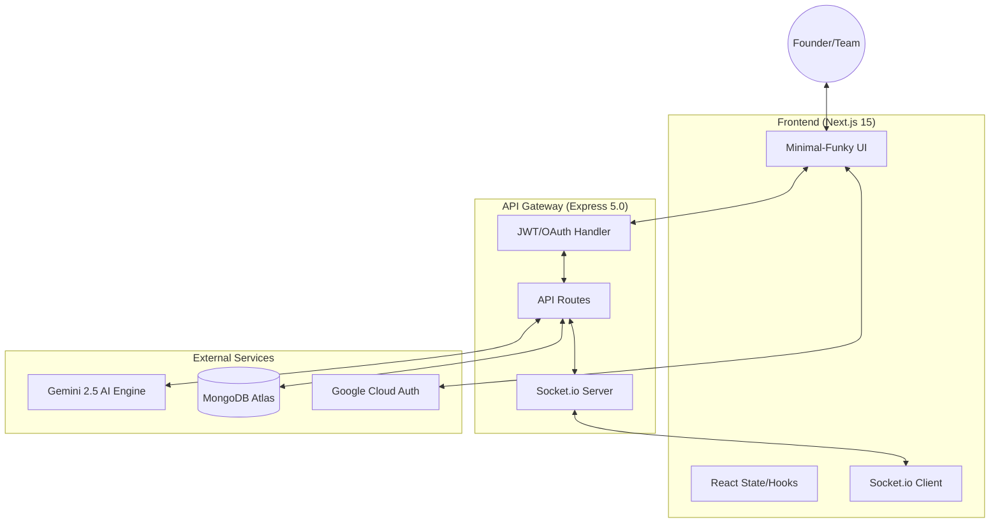
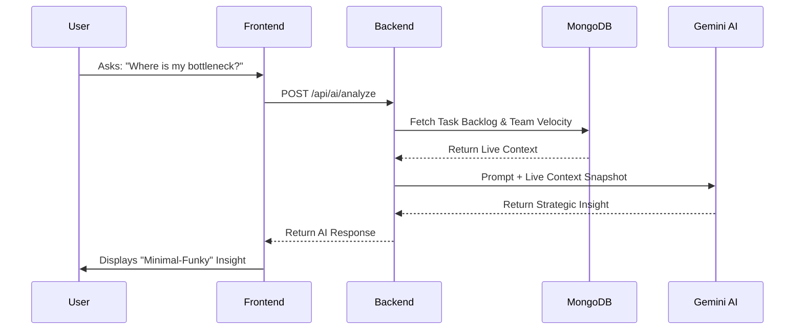

# ⚡ BEACON | The Startup Operating System

[](https://opensource.org/licenses/MIT)
[](https://nextjs.org/)
[](https://nodejs.org/)
[](https://deepmind.google/technologies/gemini/)

**Beacon** is a high-fidelity, production-grade operating system designed for founders. It centralizes startup coordination, financial tracking, and team management into a single "Minimal-Funky" interface.

---

## 📖 Table of Contents
- [Aesthetic & Design](#-aesthetic--design)
- [Core Features](#-core-features)
- [Tech Stack & Dependencies](#-tech-stack--dependencies)
- [System Architecture](#-system-architecture)
- [API Reference](#-api-reference)
- [Deployment Strategy](#-deployment-strategy)
- [Environment Configuration](#-environment-configuration)
- [Local Development](#-local-development)

---

## 🎨 Aesthetic & Design
Beacon follows a **"Cyber-Foundry"** design language:
- **Glassmorphism**: Advanced `backdrop-filter` utility for depth.
- **Dynamic Themes**: Dual-mode (Light/Dark) support via `next-themes` with HSL-tailored tokens.
- **Micro-Animations**: CSS Keyframe animations (`fadeIn`, `float`) for fluid UX.
- **Typography**: Inter & Geist Mono hierarchy for a state-of-the-art SaaS feel.

---

## 🚀 Core Features
- **AI Co-Founder**: Real-time analysis of financials, tasks, and team data via Gemini 2.5.
- **High-Fidelity Task Board**: Drag-and-drop kanban with integrated discussion threads.
- **Financial Growth Mapping**: Live data visualization of revenue and funding runway using `recharts`.
- **Unified Channels**: Logical grouping into Navigation, Communication Channels, and Startup OS tools.
- **Google OAuth Integration**: Secure, one-click workspace access.

---

## 🛠 Tech Stack & Dependencies

### Frontend (`/frontend`)
- **Framework**: Next.js 15 (App Router)
- **State/Hooks**: React 19
- **Auth**: `@react-oauth/google`
- **Styling**: Vanilla CSS (Global Theme System)
- **Icons**: `lucide-react`
- **Charts**: `recharts`
- **Real-time**: `socket.io-client`
- **Notifications**: `react-hot-toast`
- **Markdown**: `react-markdown`

### Backend (`/backend`)
- **Runtime**: Node.js
- **Server**: Express 5.0
- **Database**: MongoDB (via Mongoose)
- **AI Engine**: `@google/generative-ai` (Gemini)
- **Real-time**: `socket.io`
- **Auth**: `jsonwebtoken`, `bcryptjs`, `google-auth-library`
- **Payments**: `stripe` (Infrastructure ready)

---

## 🏗 System Architecture

### High-Level Components


### Data Flow Pipeline (AI Analysis Loop)


---

## 📡 API Reference

### Authentication
- `POST /api/auth/register` - Create new workspace.
- `POST /api/auth/login` - Email/Password sign-in.
- `POST /api/auth/google` - Google OAuth sign-in/up.

### Startup Management
- `GET /api/startup/tasks` - Fetch all workspace tasks.
- `POST /api/startup/tasks` - Create new task.
- `PUT /api/startup/tasks/:id` - Update task status/title.
- `POST /api/startup/tasks/:id/comments` - Add task discussion.

### AI Engine
- `POST /api/ai/analyze` - Request context-aware analysis from the AI Co-founder.

---

## 🚀 Deployment Strategy

### Frontend (Vercel)
1. Push to GitHub.
2. Connect Vercel to the repo.
3. Add `NEXT_PUBLIC_API_URL` and `NEXT_PUBLIC_GOOGLE_CLIENT_ID`.
4. Build Command: `next build`.

### Backend (Render / Heroku)
1. Deploy as a Web Service.
2. Set Environment variables for Mongo, JWT, Gemini, and Google.
3. Ensure port 5001 (or dynamic `$PORT`) is exposed.

### Database (MongoDB Atlas)
1. Create a M0 Free Tier Cluster.
2. Whitelist deployment IP addresses.
3. Copy the Connection String to `MONGO_URI`.

---

## ⚙️ Environment Configuration

### Backend (`/backend/.env`)
```env
PORT=5001
MONGO_URI=your_mongodb_connection_string
JWT_SECRET=your_super_secret_string
GEMINI_API_KEY=your_google_ai_key
GOOGLE_CLIENT_ID=your_google_oauth_client_id
GOOGLE_CLIENT_SECRET=your_google_oauth_secret
FRONTEND_URL=http://localhost:3000
```

### Frontend (`/frontend/.env.local`)
```env
NEXT_PUBLIC_API_URL=http://localhost:5001
NEXT_PUBLIC_GOOGLE_CLIENT_ID=your_google_oauth_client_id
```

---

## 💻 Local Development

### Quick Start
```bash
# 1. Clone
git clone https://github.com/shahpershahin/Beacon.git

# 2. Run Backend
cd backend && npm install && npm run dev

# 3. Run Frontend
cd ../frontend && npm install && npm run dev
```

### Key Commands
- `npm run dev`: Start development server (with HMR).
- `npm run build`: Production bundle generation.
- `npm start`: Start production server.
- `npm run lint`: Run ESLint checks.

---

**Built with ⚡ by founders, for founders.**
